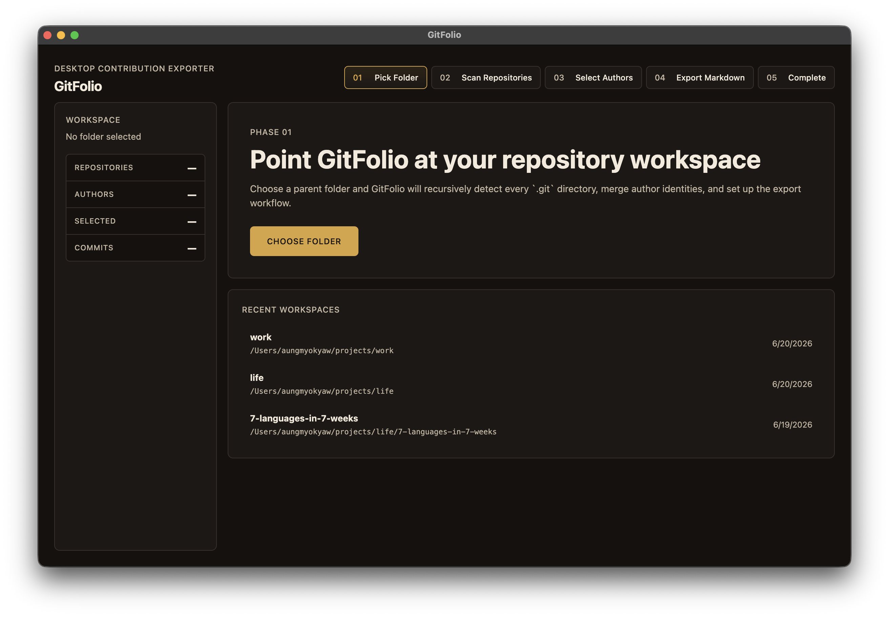
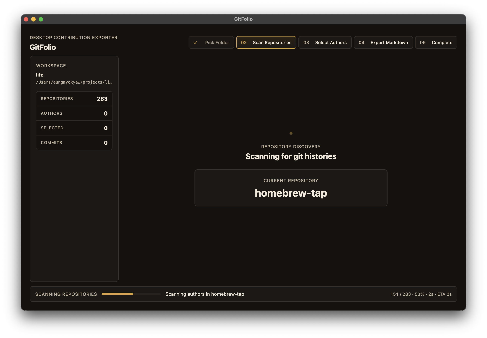
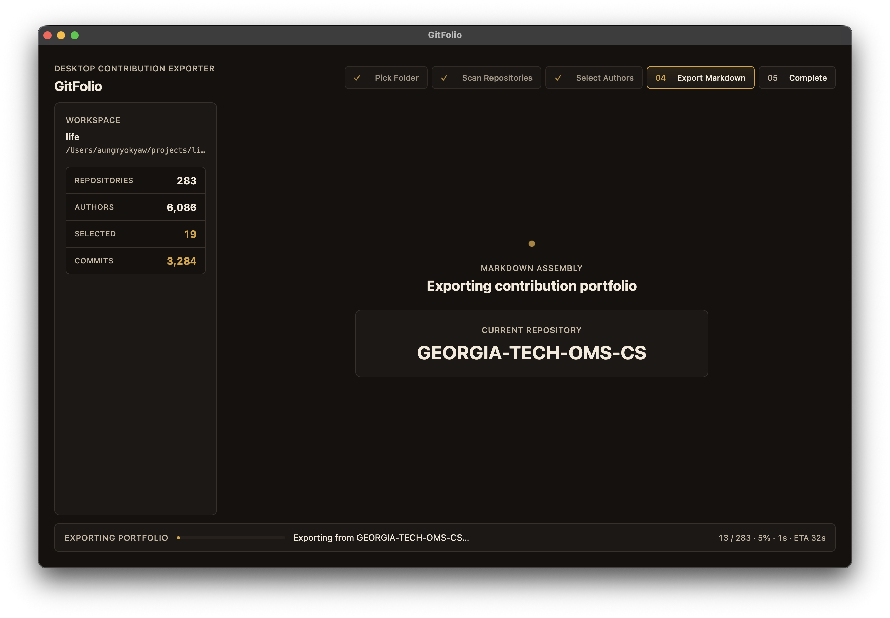
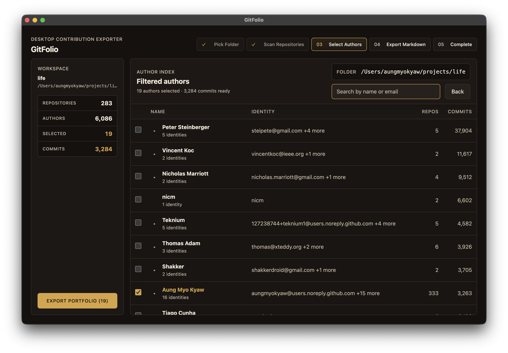
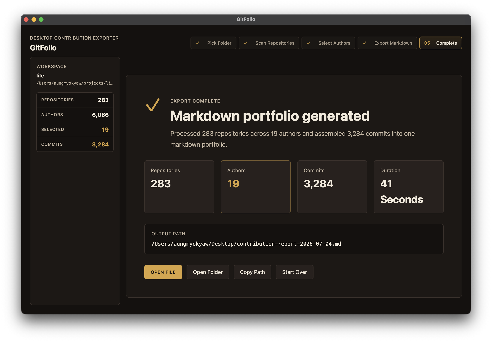

# GitFolio

Turn a folder of cloned git repositories into a single Markdown contribution portfolio.

Ever looked back at a year of commits and wondered, "what did I actually work on?" GitFolio scans your local repos, lets you pick one or more author identities, and exports every matching commit — with diffs — into one readable `.md` file. Useful for resumes, performance reviews, portfolio building, or just remembering what you shipped.

## Screenshots

| Pick a folder | Scan repositories | Select authors |
|---|---|---|
|  |  |  |

| Export Markdown | Complete |
|---|---|
|  |  |

---

## Features

- **Recursive repo scanning** — point GitFolio at `~/projects` or `~/work`; it finds every `.git` folder up to 5 levels deep and skips `node_modules` and hidden directories.
- **Author grouping** — the same person with multiple git emails collapses into one group, so scattered identities are easy to select together.
- **Search & multi-select** — filter authors by name or email, toggle individual identities, and select whole groups.
- **Recent workspaces** — quickly reopen the last few folders you scanned.
- **Live progress** — see repo count, author count, commits found, and elapsed time during scan and export.
- **Diff-aware export** — lockfiles, binary files, and generated artifacts are skipped; large commits show only the top changed files; per-file diffs are capped at ~200 lines.
- **Markdown output** — one clean file organized by repository and chronology, with ` ```diff ` blocks that render well in readers and AI tools.

---

## Installation

### Download a release

Grab the latest `.dmg` (macOS) or `.zip` from [GitHub Releases](../../releases) and install it like any desktop app.

### macOS via Homebrew

```bash
brew tap AungMyoKyaw/homebrew-tap
brew install --cask gitfolio
```

The cask automatically removes the Gatekeeper quarantine so the app opens without warnings.

### Build from source

Requires [Bun](https://bun.sh) 1.4+ and `git` on your PATH.

```bash
bun install
bun run package
```

The packaged app lands in `dist/`.

---

## Usage

1. **Pick a folder** containing your cloned git repositories.
2. **Scan** — GitFolio discovers repos and extracts every author by name + email.
3. **Select authors** — search, expand grouped identities, and choose one or more people.
4. **Export** — choose an output `.md` file and let GitFolio collect commits and diffs.
5. **Open** the generated Markdown and review your contribution portfolio.

---

## Output example

````markdown
# Contribution Report: Alice Chen

- **Total Repos:** 12
- **Total Commits:** 347
- **Date Range:** 2022-03-14 → 2024-11-28

---

## Repo: design-system

### 2024-11-28 — abc1234
**feat:** add dark mode toggle

#### `src/components/ThemeToggle.tsx`
```diff
+ import { useState, useEffect } from 'react';
+
+ export function ThemeToggle() {
+   const [dark, setDark] = useState(false);
+   useEffect(() => {
+     document.documentElement.classList.toggle('dark', dark);
+   }, [dark]);
+   return (
+     <button onClick={() => setDark(!dark)}>
+       {dark ? '🌙' : '☀️'}
+     </button>
+   );
+ }
```

## Repo: api-gateway
...
````

---

## Development

```bash
# Install dependencies
bun install

# Start the app in dev mode
bun run dev

# Build production artifacts to out/
bun run build

# Package the desktop app to dist/
bun run package

# Run tests
bun test

# Run TypeScript checks
bun run typecheck
```

### Tech stack

- **Desktop shell:** Electron 43
- **Build tool:** electron-vite
- **Frontend:** React 19 + TypeScript 6
- **Package manager:** Bun 1.4.0
- **Testing:** Vitest 4

---

## Roadmap

- Config file for exclude patterns
- Export to HTML or PDF
- Date-range filtering
- GitHub API integration for PRs and issues
- Language breakdown by file extension

---

## License

[MIT](LICENSE)
